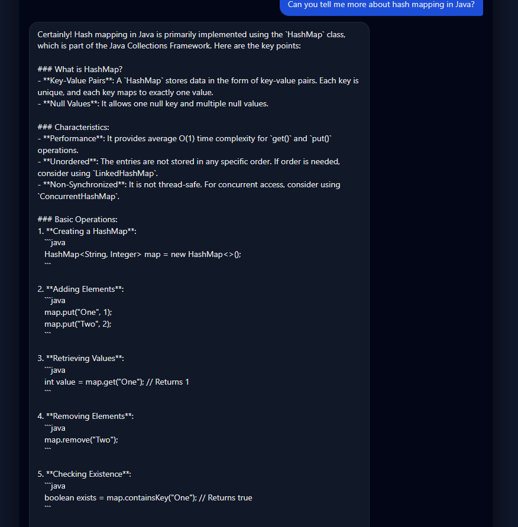

# Chatbot-Project

A Python chatbot built using the OpenAI API. This project was created to explore how to connect a language model to a simple application, manage API-based responses, and build a basic chatbot workflow.

## Overview


This project uses the OpenAI API to generate chatbot responses from user input. It was built as a hands-on project to practise Python development, API integration, environment configuration, and simple backend structure.

## Features

- Chatbot responses powered by the OpenAI API
- Python-based backend logic
- Environment variable checking for API key setup
- Modular script structure for running and testing the chatbot
- Local database file for simple storage / project experimentation

## Files

- `chatbot_openai.py` – main chatbot logic using the OpenAI API
- `server.py` – server-side application logic
- `check_env.py` – environment configuration checker
- `db.py` – database-related logic
- `chat.db` – local database file

## Tech Stack

- Python
- OpenAI API
- SQLite
- Environment variables

## Why I Built It

I built this project to learn how to integrate the OpenAI API into a Python application and understand the basics of chatbot development, including request handling, backend structure, and local data management.

## How to Run

1. Create and activate a virtual environment
2. Install dependencies
3. Set your OpenAI API key as an environment variable
4. Run the project

Example:

```bash
pip install uvicorn
uvicorn server:app --reload

http://127.0.0.1:8000